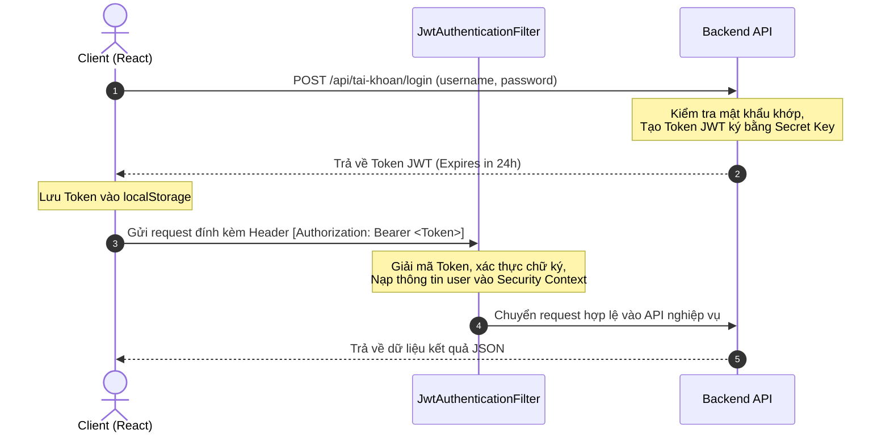
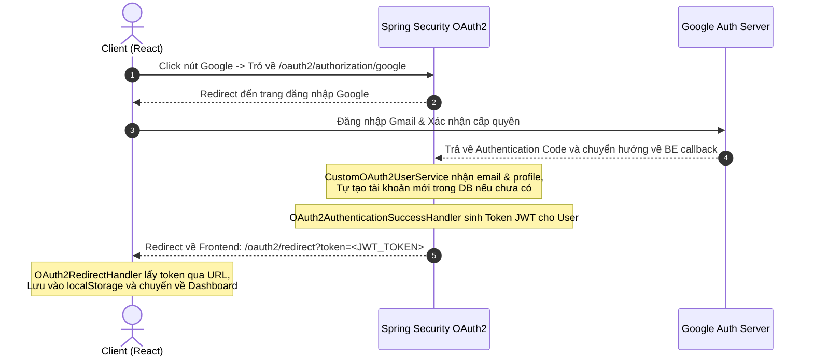

# 🔐 Bảo Mật Spring Security, JWT & Google OAuth2

Tài liệu này giải thích chi tiết về hệ thống bảo mật không lưu trạng thái (Stateless), cơ chế xác thực Token JWT, luồng đăng nhập bên thứ ba bằng tài khoản Google (OAuth2) và quy trình khôi phục mật khẩu qua mã OTP gửi về Gmail.

---

## 🔑 1. Cơ Chế Xác Thực JWT (JSON Web Token)

Dự án sử dụng cơ chế xác thực **Stateless (Không trạng thái)** bằng JWT. Server không lưu trữ phiên làm việc của người dùng trong bộ nhớ (Session), mà đóng gói toàn bộ thông tin xác thực vào một chuỗi mã hóa gọi là Token.

### Cấu trúc một chuỗi Token JWT gồm 3 phần (phân tách bởi dấu chấm `.`):
1.  **Header**: Chứa thuật toán mã hóa (ví dụ: HS256) và kiểu token (JWT).
2.  **Payload (Claims)**: Chứa thông tin người dùng được mã hóa (chứa `username` và danh sách quyền `role`).
3.  **Signature (Chữ ký)**: Tạo thành bằng cách băm (hash) phần Header, Payload kết hợp với một chuỗi khóa bí mật (`jwt.secret`) chỉ duy nhất Server biết. Nhờ đó, nếu Client cố tình sửa đổi thông tin trong Payload, chữ ký sẽ không khớp và Token bị vô hiệu ngay lập tức.

---

## ⚙️ 2. Cấu Hình Spring Security (`SecurityConfig.java`)

File [SecurityConfig.java](file:///d:/test_antigravity/backend/src/java/com/btl/server/security/SecurityConfig.java) là "trái tim" cấu hình bảo mật của backend.

### Các thiết lập quan trọng:
*   `csrf().disable()`: Vô hiệu hóa tính năng chống tấn công CSRF (Cross-Site Request Forgery). Vì ứng dụng chạy chế độ Stateless dùng JWT (Token không tự động đính kèm qua Cookie giống Session), nên không có nguy cơ bị tấn công CSRF.
*   `sessionManagement().sessionCreationPolicy(SessionCreationPolicy.STATELESS)`: Cấu hình Spring Security không tạo hay lưu trữ Session trên server.
*   `authorizeHttpRequests()`: Thiết lập phân quyền truy cập endpoint:
    *   *Mở công khai (Permit All)*: `/api/tai-khoan/**` (Đăng ký, Đăng nhập, OTP), `/api/phong-tro/search` (tìm phòng trống), `/oauth2/**` (endpoints xử lý Google login), các cổng websocket `/ws/**`.
    *   *Phân quyền vai trò (Has Role)*:
        *   Các API thống kê và quản lý tài khoản chung yêu cầu quyền `ROLE_ADMIN`.
        *   Các API quản lý thông số phòng, hóa đơn, thông báo yêu cầu quyền `ROLE_LANDLORD` (Chủ trọ).
        *   Các API làm hợp đồng, gửi khiếu nại, xem hóa đơn cá nhân yêu cầu quyền `ROLE_USER` (Khách thuê).
*   `addFilterBefore(jwtAuthenticationFilter, UsernamePasswordAuthenticationFilter.class)`: Chèn thêm Filter xác thực JWT tự định nghĩa vào trước bộ lọc mặc định của Spring Security.

---

## 🔄 3. Luồng Hoạt Động Của Hệ Thống

### 🅰️ Luồng Đăng Nhập & Giao Tiếp Chuẩn Bằng JWT:

### 🅱️ Luồng Đăng Nhập Google OAuth2:

---

## 📧 4. Cơ Chế Quên Mật Khẩu & Xác Thực OTP
*   **Yêu cầu OTP (`POST /api/tai-khoan/forgot-password`)**:
    1.  Nhận email từ client. Kiểm tra xem email này có tồn tại trong bảng `TaiKhoan` hay không.
    2.  Tự động tạo chuỗi OTP gồm 6 chữ số ngẫu nhiên.
    3.  Lưu mã OTP này và thời gian hết hạn (5 phút sau) trực tiếp vào bảng `TaiKhoan` của người dùng đó.
    4.  Gọi [MailService.java](file:///d:/test_antigravity/backend/src/java/com/btl/server/service/MailService.java) sử dụng JavaMailSender gửi email HTML thông báo mã OTP.
*   **Đổi mật khẩu mới (`POST /api/tai-khoan/reset-password`)**:
    1.  Nhận email, OTP và mật khẩu mới từ client.
    2.  Kiểm tra tài khoản theo email -> so khớp mã OTP trong DB và kiểm tra xem thời gian hết hạn (`otpExp`) đã vượt quá thời gian hiện tại (`LocalDateTime.now()`) hay chưa.
    3.  Nếu hợp lệ: Băm mật khẩu mới bằng `BCryptPasswordEncoder` và lưu đè mật khẩu cũ, đồng thời xóa mã OTP và thời hạn trong DB (set về null).

---

## 💬 5. Bộ Câu Hỏi Vấn Đáp Về Security & OAuth2 (Q&A)

### ❓ Câu 1: JWT là gì? Tại sao em dùng JWT thay vì Session & Cookie truyền thống?
*   **Trả lời**: JWT (JSON Web Token) là phương thức xác thực người dùng không lưu trạng thái (Stateless).
    *   *So với Session/Cookie*: Khi dùng Session, server phải lưu thông tin người dùng trong bộ nhớ RAM, nếu số lượng truy cập tăng đột biến hoặc hệ thống mở rộng đa máy chủ (Multi-server), việc đồng bộ session sẽ rất phức tạp và tốn tài nguyên.
    *   *Lợi ích của JWT*: Server không cần lưu gì cả, chỉ cần xác thực chữ ký của Token là biết danh tính người dùng. Giúp ứng dụng dễ mở rộng (Scalable), tương thích tốt với các ứng dụng Client-Side độc lập (như React, Mobile App) và tăng tốc độ xử lý của server.

### ❓ Câu 2: Nếu Token JWT bị đánh cắp thì kẻ xấu có giả mạo người dùng được không? Em làm cách nào để giảm thiểu rủi ro này?
*   **Trả lời**: Có, nếu kẻ xấu lấy được Token JWT hợp lệ, họ có thể đính kèm nó vào Header để gọi API với tư cách người dùng đó.
    *   *Cách khắc phục/Giảm thiểu*:
        1.  Chỉ gửi Token qua giao thức bảo mật mã hóa **HTTPS** để tránh bị nghe lén trên đường truyền.
        2.  Đặt thời gian hết hạn của token ở mức hợp lý (Ví dụ trong ứng dụng này là 24 giờ).
        3.  Trong các hệ thống lớn, có thể thiết kế thêm cơ chế **Refresh Token** (Token ngắn hạn khoảng 15 phút, kết hợp Token dài hạn lưu trong HttpOnly Cookie để cấp lại mã) hoặc duy trì danh sách đen các token bị thu hồi (Token Blacklisting) qua Redis.

### ❓ Câu 3: BCryptPasswordEncoder hoạt động như thế nào? Làm sao so sánh được mật khẩu lúc đăng nhập nếu mỗi lần băm lại ra một chuỗi khác nhau do dùng Muối (Salt) ngẫu nhiên? Có giải mã ngược lại được không?
*   **Trả lời**: 
    *   **Không thể giải mã ngược lại**: BCrypt là thuật toán băm một chiều (One-Way Hashing). Một khi đã băm thì không có cách nào dịch ngược về mật khẩu ban đầu.
    *   **Cơ chế lưu Salt (Muối)**: Khi ta đăng ký tài khoản, BCrypt sinh ra một chuỗi **Salt ngẫu nhiên** kết hợp với mật khẩu gốc rồi băm. Tuy nhiên, **Salt này không mất đi mà được nhúng trực tiếp vào trong chuỗi kết quả băm** được lưu dưới DB.
        *   *Ví dụ chuỗi băm lưu dưới DB*: `$2a$10$vI8aWBnW3fID.RtFjSJM2uMx863V43t9v2rV69rA.fQ3u2Wp12345`
        *   `$2a$`: Phiên bản thuật toán.
        *   `$10$`: Độ phức tạp (Logarithmic rounds - 2^10 lần lặp).
        *   `vI8aWBnW3fID.RtFjSJM2`: Đây chính là **chuỗi Muối (Salt)** ngẫu nhiên dài 22 ký tự.
        *   `uMx863V43t9v2rV69rA.fQ3u2Wp12345`: Phần dữ liệu mật khẩu đã được băm.
    *   **Cách đối chiếu lúc đăng nhập (`matches`)**: 
        *   Suy nghĩ của bạn là **hoàn toàn đúng**: hệ thống thực chất vẫn băm mật khẩu người dùng vừa nhập rồi đem so sánh hai chuỗi băm.
        *   *Nhưng làm sao lấy đúng Salt cũ?* Khi gọi hàm `encoder.matches(rawPassword, encodedPassword)`, BCrypt sẽ **tự động tách chuỗi Salt** (`vI8aWBnW3fID.RtFjSJM2`) từ chuỗi `encodedPassword` lấy từ database ra.
        *   Sau đó, nó lấy `rawPassword` (khách nhập) băm cùng với **chính cái Salt vừa tách được**.
        *   Vì dùng chung một Salt và một thuật toán, kết quả băm mới chắc chắn sẽ trùng khớp hoàn toàn với chuỗi băm trong DB nếu mật khẩu nhập vào là chính xác. Nếu khớp, hàm `matches` trả về `true`.

### ❓ Câu 4: Luồng xử lý OAuth2 Google hoạt động ra sao nếu người dùng đăng nhập lần đầu tiên?
*   **Trả lời**: Khi người dùng đăng nhập Google thành công, Google trả về profile (email, tên, avatar). 
    *   Lớp `CustomOAuth2UserService` kiểm tra email xem đã tồn tại trong bảng `TaiKhoan` chưa.
    *   Nếu **chưa tồn tại**, hệ thống sẽ tự động đăng ký: Tạo một `TaiKhoan` mới (username là email, password để ngẫu nhiên, role là `ROLE_USER`, provider là `GOOGLE`), đồng thời tạo bản ghi `KhachHang` tương ứng chứa họ tên lấy từ Google.
    *   Sau đó, `OAuth2AuthenticationSuccessHandler` tạo JWT Token và gửi token này về cho Frontend thông qua redirect URL param.
