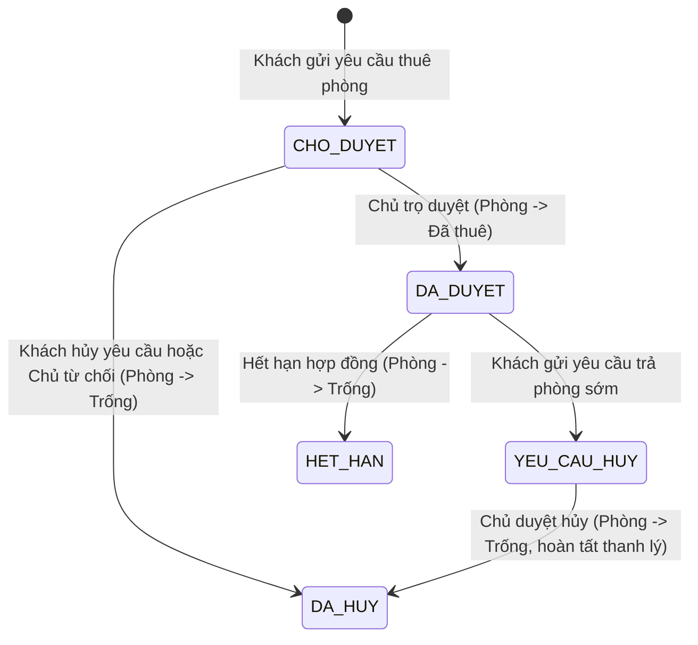

# 🧠 Logic Nghiệp Vụ & Tầng Xử Lý Dịch Vụ (Service)

Tài liệu này giải thích chi tiết logic xử lý nghiệp vụ chính tại tầng Service bao gồm quy trình quản lý vòng đời hợp đồng, công thức tính hóa đơn điện nước hàng tháng, hệ thống lưu vết nhật ký hệ thống và tổng hợp báo cáo doanh thu.

---

## 📜 1. Logic Quản Lý Vòng Đời Hợp Đồng (`HopDongService`)

Quy trình thuê phòng trọ được quản lý nghiêm ngặt qua 3 trạng thái chính: **Chờ duyệt**, **Đã duyệt**, và **Hủy hợp đồng**.



### Chi tiết mã nguồn nghiệp vụ:
*   **Đăng ký thuê phòng (`createHopDong`)**:
    1.  Kiểm tra xem phòng trọ (`PhongTro`) có đang ở trạng thái `TRONG` (trống) không.
    2.  Nếu không trống (đang bảo trì hoặc đã được thuê bởi người khác), ném ra `BadRequestException` nhằm chặn đăng ký chéo.
    3.  Tạo hợp đồng mới với trạng thái ban đầu là `CHO_DUYET`. Khách thuê tạm thời rơi vào màn hình chờ.
*   **Phê duyệt thuê phòng (`duyetHopDong`)**:
    1.  Chỉ chủ trọ quản lý phòng đó mới được phép duyệt hợp đồng.
    2.  Cập nhật trạng thái hợp đồng thành `DA_DUYET`.
    3.  Cập nhật trạng thái của `PhongTro` tương ứng thành `DA_THUE` (đã thuê) để ẩn phòng này khỏi trang tìm kiếm công khai.
*   **Hủy hợp đồng / Trả phòng sớm (`khachHuyHopDong`)**:
    1.  Nếu hợp đồng chưa duyệt (`CHO_DUYET`), cho phép xóa/hủy thẳng để giải phóng phòng về trạng thái `TRONG`.
    2.  Nếu hợp đồng đang hoạt động (`DA_DUYET`), hệ thống chuyển trạng thái hợp đồng sang `YEU_CAU_HUY`.
    3.  Chủ trọ sẽ gọi API `duyetHuyHopDong` để chốt công nợ, khấu trừ đặt cọc, giải phóng phòng trọ về trạng thái `TRONG` và kết thúc hợp đồng (`DA_HUY`).

---

## 💵 2. Logic Tính Hóa Đơn Điện Nước (`HoaDonService`)

Hóa đơn tiền phòng hàng tháng được sinh tự động khi chủ nhà chốt số điện nước mới thông qua API `/api/hoa-don/tinh-tien/{phongId}` nhận dữ liệu `PhieuTinhTienDTO`.

### Quy trình nghiệp vụ:
1.  **Kiểm tra tính hợp lệ của số đo**:
    *   Hệ thống so sánh số điện mới (`soDienMoi`) với số điện cũ (`soDienCu`) lưu trong bảng `PhongTro`.
    *   Yêu cầu bắt buộc: `soDienMoi >= soDienCu` và `soNuocMoi >= soNuocCu`. Nếu vi phạm, hệ thống ném ra `BadRequestException` yêu cầu nhập lại.
2.  **Tính toán chi tiết hóa đơn**:
    *   `Sản lượng điện tiêu thụ = soDienMoi - soDienCu`
    *   `Tiền điện = Sản lượng điện * đơn giá điện của phòng`
    *   `Sản lượng nước tiêu thụ = soNuocMoi - soNuocCu`
    *   `Tiền nước = Sản lượng nước * đơn giá nước của phòng`
    *   `Tổng thanh toán = Tiền phòng + Tiền điện + Tiền nước`
3.  **Cập nhật chỉ số cơ sở và tạo hóa đơn**:
    *   Lưu đè số điện/nước mới vào thuộc tính `soDienCu` và `soNuocCu` trong bảng `PhongTro` để làm cơ sở tính tiền cho tháng tiếp theo.
    *   Lưu lịch sử số đo vào bảng `ChiSoDienNuoc`.
    *   Tạo bản ghi `HoaDon` mới ghi nhận công nợ trạng thái `CHUA_THANH_TOAN` gửi đến tài khoản khách thuê.

---

## 📊 3. Nghiệp Vụ Báo Cáo Thống Kê & Nhật Ký Hệ Thống

### 📈 Thống Kê (`ThongKeService`):
Cung cấp số liệu tổng quan thông qua API `/api/thong-ke`:
*   *Thống kê doanh thu*: Tính tổng tiền (`tongTien`) của toàn bộ các hóa đơn có trạng thái `DA_THANH_TOAN` trong tháng/năm yêu cầu.
*   *Thống kê cơ sở*: Đếm tổng số phòng trọ (`phongTroRepository.count()`), số lượng phòng trống, số lượng phòng đã thuê để hiển thị biểu đồ tròn tỉ lệ lấp đầy.

### 📝 Nhật Ký Hoạt Động (`NhatKyService`):
Mỗi khi người dùng thực hiện các hành động nhạy cảm hoặc quan trọng, hệ thống tự động gọi hàm `ghiNhatKy(taiKhoan, hanhDong, chiTiet)` để ghi lại thông tin vào bảng `NhatKyHoatDong`.
*   *Các hành động ghi nhận*: Đăng nhập, thay đổi mật khẩu, duyệt hợp đồng, thanh toán hóa đơn.
*   *Mục đích*: Giúp Admin theo dõi vết hoạt động của toàn hệ thống, phát hiện các hành vi gian lận hoặc truy cập trái phép.

---

## 💬 4. Bộ Câu Hỏi Vấn Đáp Nghiệp Vụ (Q&A)

### ❓ Câu 1: Em hãy giải thích ý nghĩa và cách hoạt động của Annotation `@Transactional` trong tầng Service?
*   **Trả lời**: `@Transactional` dùng để quản lý giao dịch cơ sở dữ liệu (Transaction). Nó đảm bảo tính toàn vẹn của dữ liệu theo nguyên tắc **ACID**.
    *   *Hoạt động*: Khi một hàm được đánh dấu `@Transactional` chạy, Spring sẽ bắt đầu một Transaction. Nếu tất cả các câu lệnh SQL trong hàm chạy thành công không có lỗi, Spring sẽ thực hiện **Commit** để lưu vĩnh viễn thay đổi vào CSDL. 
    *   *Nếu xảy ra ngoại lệ (Exception)*: Hệ thống sẽ tự động thực hiện **Rollback** - phục hồi lại toàn bộ trạng thái dữ liệu trước khi hàm chạy, như chưa từng có thay đổi nào xảy ra. Tránh tình trạng dữ liệu bị cập nhật dở dang (ví dụ: tiền phòng đã trừ nhưng trạng thái hợp đồng chưa cập nhật).

### ❓ Câu 2: Em thiết kế lưu trữ chỉ số điện nước như thế nào để phục vụ việc tính tiền và xem lịch sử?
*   **Trả lời**: Em thiết kế lưu trữ ở 2 nơi để tối ưu hóa truy vấn:
    1.  Chỉ số cũ (`soDienCu`, `soNuocCu`) được lưu trực tiếp tại bảng `PhongTro`. Việc này giúp hệ thống lấy nhanh số đo cũ để validate số đo mới ngay lập tức mà không cần truy vấn bảng lịch sử phức tạp.
    2.  Khi chốt số điện nước thành công, chỉ số đo mới cùng thời gian chốt sẽ được lưu thành một bản ghi lịch sử riêng biệt tại bảng `ChiSoDienNuoc` (quan hệ `@ManyToOne` với `PhongTro`). Bảng này phục vụ việc vẽ biểu đồ theo dõi điện nước hoặc xem lịch sử tiêu thụ của khách thuê.

### ❓ Câu 3: Làm thế nào để tính tổng doanh thu của chủ trọ trong một tháng cụ thể? Em viết câu lệnh truy vấn như thế nào?
*   **Trả lời**: Em sử dụng câu lệnh JPQL (Java Persistence Query Language) trong Repository để tính tổng tiền của các hóa đơn đã thanh toán:
    ```java
    @Query("SELECT SUM(h.tongTien) FROM HoaDon h WHERE h.phongTro.chuTro.id = :chuTroId AND h.thang = :thang AND h.nam = :nam AND h.trangThai = 'DA_THANH_TOAN'")
    Double tinhDoanhThuChuTro(Long chuTroId, int thang, int nam);
    ```
    Hàm này thực hiện tính tổng cột `tongTien` từ bảng `HoaDon` kết hợp các điều kiện lọc theo ID chủ trọ, tháng, năm và trạng thái thanh toán phải là `DA_THANH_TOAN`.

### ❓ Câu 4: Nếu khách thuê bấm "Thanh toán hóa đơn" thành công, hệ thống xử lý nghiệp vụ gì?
*   **Trả lời**: Khi khách bấm thanh toán:
    1.  Hệ thống chuyển trạng thái `HoaDon` từ `CHUA_THANH_TOAN` sang `DA_THANH_TOAN`.
    2.  Ghi nhận nhật ký hệ thống qua `NhatKyService` (Ví dụ: "Khách hàng A đã thanh toán hóa đơn tiền phòng tháng X").
    3.  Tạo và gửi một thông báo hệ thống tự động đến tài khoản của Chủ trọ để báo tin hóa đơn phòng đã được thanh toán hoàn tất.
