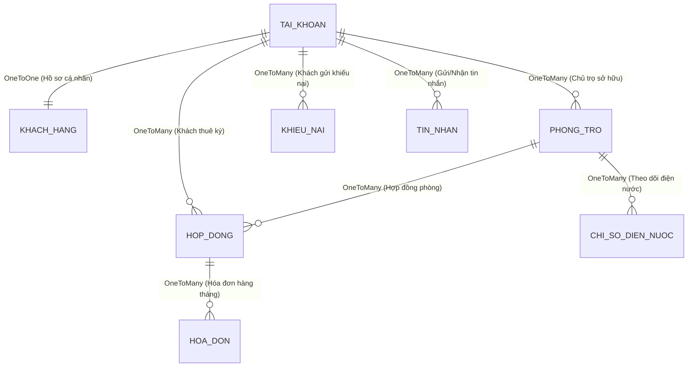

# 🗄️ Thiết Kế Cơ Sở Dữ Liệu & Thực Thể JPA (Entity)

Tài liệu này giải thích chi tiết cấu trúc Database, các lớp Entity JPA, mối quan hệ giữa các thực thể và các tập hợp Enum quản lý trạng thái trong hệ thống.

---

## 🗺️ 1. Mô Hình Mối Quan Hệ Giữa Các Thực Thể (ERD & JPA Relationships)

Hệ thống quản lý phòng trọ sử dụng các mối quan hệ thực thể cốt lõi sau để liên kết các luồng dữ liệu:

---

## 📝 2. Chi Tiết Các Entity Chính & Ý Nghĩa Thuộc Tính

### 1️⃣ Thực Thể `TaiKhoan` ([TaiKhoan.java](file:///d:/test_antigravity/backend/src/java/com/btl/server/entity/TaiKhoan.java))
*   **Ý nghĩa**: Lưu trữ thông tin đăng nhập, phân quyền và OTP.
*   **Các thuộc tính quan trọng**:
    *   `id` (Long): Khóa chính tự tăng.
    *   `username` (String): Tên đăng nhập (duy nhất).
    *   `password` (String): Mật khẩu đã băm bcrypt.
    *   `email` (String): Địa chỉ email dùng để xác thực và nhận OTP.
    *   `role` (Enum `Role`): Phân quyền tài khoản (`ROLE_ADMIN`, `ROLE_LANDLORD`, `ROLE_USER`).
    *   `otpCode` (String): Mã OTP dùng cho khôi phục mật khẩu.
    *   `otpExp` (LocalDateTime): Thời gian hết hạn của OTP (thường là 5 phút).
    *   `provider` (Enum `AuthProvider`): Nguồn đăng nhập (`LOCAL`, `GOOGLE`).

### 2️⃣ Thực Thể `KhachHang` ([KhachHang.java](file:///d:/test_antigravity/backend/src/java/com/btl/server/entity/KhachHang.java))
*   **Ý nghĩa**: Lưu trữ thông tin chi tiết (hồ sơ) của khách hàng thuê phòng.
*   **Quan hệ**: `@OneToOne` với `TaiKhoan` thông qua `@JoinColumn(name = "tai_khoan_id")`.
*   **Các thuộc tính quan trọng**:
    *   `hoTen`, `soDienThoai`, `soCccd`, `ngaySinh`, `queQuan`.
    *   `tenNganHang`, `soTaiKhoan`, `chuTaiKhoan`: Phục vụ việc thanh toán/hoàn cọc tiền phòng.

### 3️⃣ Thực Thể `PhongTro` ([PhongTro.java](file:///d:/test_antigravity/backend/src/java/com/btl/server/entity/PhongTro.java))
*   **Ý nghĩa**: Thông tin phòng trọ do chủ nhà quản lý.
*   **Quan hệ**: `@ManyToOne` với `TaiKhoan` (chủ trọ) đại diện bởi `chuTroId`.
*   **Các thuộc tính quan trọng**:
    *   `tenPhong` (Tên phòng ví dụ: Phòng 101, Phòng 102).
    *   `dienTich` (m²), `giaPhong` (VND/tháng), `tienCoc` (tiền đặt cọc).
    *   `diaChi`, `moTa` (mô tả phòng), `hinhAnh` (chuỗi URL hình ảnh lưu cách nhau bởi dấu phẩy).
    *   `soDienCu`, `soNuocCu`: Lưu trữ chỉ số chốt cũ làm căn cứ tính tiền điện nước tháng tiếp theo.
    *   `trangThai` (Enum `TrangThaiPhong`): `TRONG` (trống), `DA_THUE` (đã thuê), `BAO_TRI` (bảo trì).

### 4️⃣ Thực Thể `HopDong` ([HopDong.java](file:///d:/test_antigravity/backend/src/java/com/btl/server/entity/HopDong.java))
*   **Ý nghĩa**: Pháp lý ràng buộc việc thuê phòng giữa khách thuê và chủ nhà.
*   **Quan hệ**: `@ManyToOne` với `PhongTro` và `@ManyToOne` với `TaiKhoan` (khách thuê).
*   **Các thuộc tính quan trọng**:
    *   `ngayBatDau` (ngày ký hợp đồng), `ngayKetThuc` (ngày hết hạn hợp đồng).
    *   `tienCoc` (tiền cọc thực tế đã đóng).
    *   `trangThai` (Enum `TrangThaiHopDong`): `CHO_DUYET`, `DA_DUYET`, `YEU_CAU_HUY`, `DA_HUY`, `HET_HAN`.

### 5️⃣ Thực Thể `HoaDon` ([HoaDon.java](file:///d:/test_antigravity/backend/src/java/com/btl/server/entity/HoaDon.java))
*   **Ý nghĩa**: Phiếu thanh toán dịch vụ hàng tháng.
*   **Các thuộc tính quan trọng**:
    *   `thang`, `nam`: Kỳ thanh toán.
    *   `tienPhong`, `tienDien`, `tienNuoc`, `tongTien` (tiền phòng + điện + nước).
    *   `trangThai` (Enum `TrangThaiHoaDon`): `CHUA_THANH_TOAN` hoặc `DA_THANH_TOAN`.

---

## 🔢 3. Chi Tiết Các Enum Trạng Thái

Việc sử dụng Enum giúp kiểm soát chặt chẽ trạng thái nghiệp vụ, tránh nhập sai dữ liệu:

*   **`Role`**: Phân quyền người dùng.
    *   `ROLE_ADMIN`: Quản trị viên hệ thống (quản lý tài khoản, xem thống kê toàn cục).
    *   `ROLE_LANDLORD`: Chủ trọ (quản lý phòng, tạo hóa đơn, phê duyệt hợp đồng).
    *   `ROLE_USER`: Khách thuê (tìm phòng, ký hợp đồng, thanh toán hóa đơn, gửi khiếu nại).
*   **`TrangThaiPhong`**:
    *   `TRONG`: Sẵn sàng cho thuê (hiển thị trên trang tìm kiếm).
    *   `DA_THUE`: Đã có khách ở (ẩn khỏi trang tìm kiếm).
    *   `BAO_TRI`: Phòng đang sửa chữa, không thể đăng ký thuê.
*   **`TrangThaiHopDong`**:
    *   `CHO_DUYET`: Khách vừa đăng ký thuê, đợi chủ trọ chấp nhận.
    *   `DA_DUYET`: Chủ trọ đã ký duyệt, hợp đồng có hiệu lực.
    *   `YEU_CAU_HUY`: Khách thuê muốn trả phòng, gửi yêu cầu đợi chủ trọ xác nhận.
    *   `DA_HUY` / `HET_HAN`: Hợp đồng kết thúc.
*   **`TrangThaiHoaDon`**:
    *   `CHUA_THANH_TOAN`: Hóa đơn nợ (hiển thị VietQR cho khách quét).
    *   `DA_THANH_TOAN`: Đã thanh toán thành công (khách có thể in hóa đơn).

---

## 💬 4. Bộ Câu Hỏi Vấn Đáp Về Database & JPA (Q&A)

### ❓ Câu 1: Em hãy phân biệt sự khác nhau giữa `@ManyToOne` và `@OneToMany`? Trong dự án của em có ví dụ cụ thể nào?
*   **Trả lời**:
    *   `@ManyToOne` (Nhiều - Một): Được khai báo ở thực thể đóng vai trò là "Nhiều", thường chứa khóa ngoại kết nối sang bảng "Một".
    *   `@OneToMany` (Một - Nhiều): Được khai báo ở thực thể đóng vai trò là "Một", thường chứa thuộc tính danh sách `List<Entity>` và sử dụng thuộc tính `mappedBy` trỏ về phía bên "Nhiều".
    *   *Ví dụ*: Một `PhongTro` có thể có nhiều `HopDong` trong lịch sử. Trong class [HopDong.java](file:///d:/test_antigravity/backend/src/java/com/btl/server/entity/HopDong.java), em dùng `@ManyToOne` kết nối đến `PhongTro` (chứa khóa ngoại `phong_tro_id`). Trong class [PhongTro.java](file:///d:/test_antigravity/backend/src/java/com/btl/server/entity/PhongTro.java), em dùng `@OneToMany(mappedBy = "phongTro")` để trỏ ngược lại danh sách hợp đồng.

### ❓ Câu 2: Tại sao em lại tách `TaiKhoan` và `KhachHang` thành 2 thực thể riêng biệt mà không gộp chung làm một bảng?
*   **Trả lời**: Đây là cách thiết kế cơ sở dữ liệu chuẩn hóa nhằm phân tách mối quan tâm:
    *   Bảng `TaiKhoan` chỉ quản lý các thông tin liên quan đến **đăng nhập và bảo mật** (username, password, email, role, OTP, OAuth2).
    *   Bảng `KhachHang` chỉ lưu thông tin cá nhân **nghiệp vụ dân sự** (CCCD, SĐT, tài khoản ngân hàng, ngày sinh).
    *   Tách biệt giúp tối ưu hóa hiệu năng truy vấn (khi chỉ cần check đăng nhập thì không cần load các thông tin cá nhân cồng kềnh) và giúp kiến trúc sạch sẽ hơn.

### ❓ Câu 3: Thuộc tính `cascade = CascadeType.ALL` và `orphanRemoval = true` có ý nghĩa gì? Em áp dụng nó ở đâu?
*   **Trả lời**:
    *   `cascade = CascadeType.ALL`: Định nghĩa rằng mọi thao tác (Lưu, Cập nhật, Xóa) tác động lên đối tượng cha thì cũng sẽ tự động lan truyền (cascade) áp dụng lên đối tượng con liên kết.
    *   `orphanRemoval = true`: Nếu đối tượng con bị ngắt kết nối khỏi đối tượng cha (không còn nằm trong danh sách liên kết), Hibernate sẽ tự động xóa bản ghi con đó khỏi Database.
    *   *Áp dụng*: Em áp dụng ở mối quan hệ `@OneToOne` giữa `TaiKhoan` và `KhachHang`. Khi xóa tài khoản `TaiKhoan` khỏi hệ thống, thông tin hồ sơ `KhachHang` tương ứng cũng tự động bị xóa theo để tránh dữ liệu rác.

### ❓ Câu 4: Hibernate ddl-auto=update trong cấu hình `application.properties` là gì? Khi chạy thực tế (production) có nên dùng không?
*   **Trả lời**:
    *   `ddl-auto=update`: Là cơ chế của Hibernate tự động so sánh cấu hình các class `@Entity` Java với cấu hình các bảng hiện tại trong MySQL. Nếu phát hiện có cột mới hoặc bảng mới, nó sẽ tự động chạy lệnh `ALTER TABLE` hoặc `CREATE TABLE` để cập nhật Database Schema.
    *   *Môi trường thực tế (production)*: **Tuyệt đối không nên dùng**. Vì nó có thể tự ý thay đổi cấu trúc bảng, khóa ngoại, gây nguy cơ mất mát dữ liệu hoặc làm treo hệ thống nếu schema thay đổi phức tạp. Trong thực tế, người ta sẽ dùng các công cụ quản lý phiên bản database như **Liquibase** hoặc **Flyway** để kiểm soát cập nhật DB thủ công và an toàn.
