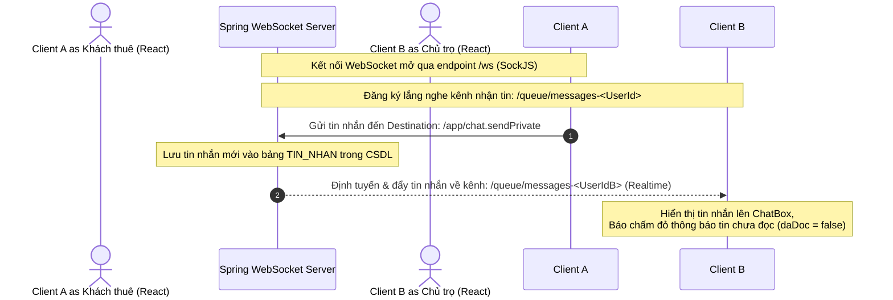

# 💬 Xử Lý Lỗi Tập Trung & Hệ Thống Chat Realtime (WebSocket)

Tài liệu này giải thích cơ chế bắt và xử lý lỗi tập trung (Global Exception Handling) trong Spring Boot và kiến trúc giao tiếp thời gian thực hai chiều (Realtime) phục vụ tính năng Chat qua giao thức WebSocket STOMP.

---

## 🛠️ 1. Cơ Chế Xử Lý Lỗi Tập Trung (`GlobalExceptionHandler`)

Thay vì viết các khối lệnh `try-catch` lặp đi lặp lại ở mọi hàm trong các Controller, dự án sử dụng cơ chế xử lý lỗi tập trung thông qua lớp [GlobalExceptionHandler.java](file:///d:/test_antigravity/backend/src/java/com/btl/server/exception/GlobalExceptionHandler.java).

### Các thành phần chính:
*   `@ControllerAdvice` (hoặc `@RestControllerAdvice`): Đánh dấu lớp này là bộ xử lý ngoại lệ toàn cục cho toàn bộ các Controller của ứng dụng.
*   `@ExceptionHandler`: Đánh dấu các hàm chịu trách nhiệm xử lý một loại ngoại lệ cụ thể khi nó bị ném ra ở bất kỳ tầng nào (Service, Controller).các
*   **Các Ngoại Lệ Tự Định Nghĩa (Custom Exceptions)**:
    *   `NotFoundException`: Trả về mã lỗi **HTTP 404 Not Found** khi không tìm thấy tài nguyên yêu cầu (Ví dụ: tìm phòng trọ, hóa đơn không tồn tại).
    *   `BadRequestException`: Trả về mã lỗi **HTTP 400 Bad Request** khi dữ liệu nghiệp vụ không hợp lệ (Ví dụ: chốt số điện mới nhỏ hơn số cũ, Gmail đăng ký trùng lặp).
    *   `ForbiddenException`: Trả về mã lỗi **HTTP 403 Forbidden** khi tài khoản cố tình gọi API vượt cấp (Ví dụ: chủ trọ này cố tình sửa/xóa phòng trọ của chủ trọ khác).

#### Luồng hoạt động khi có lỗi:
1.  Ở tầng Service, nếu phát hiện lỗi, ném ra ngoại lệ: `throw new BadRequestException("Mã OTP không chính xác");`
2.  `GlobalExceptionHandler` bắt được ngoại lệ `BadRequestException`.
3.  Đóng gói nội dung lỗi thành cấu trúc JSON chuẩn:
    ```json
    {
      "message": "Mã OTP không chính xác",
      "timestamp": "2026-06-07T16:59:30"
    }
    ```
4.  Gửi phản hồi về cho Client kèm mã trạng thái HTTP tương ứng.

---

## 🌐 2. Kiến Trúc Chat Realtime Qua WebSocket STOMP

Để khách thuê và chủ nhà có thể nhắn tin trao đổi trực tiếp thời gian thực, hệ thống sử dụng kết nối **WebSocket** kết hợp giao thức **STOMP** thay vì cơ chế HTTP Polling truyền thống (liên tục gửi request lấy tin mới gây tốn băng thông).



### Chi tiết cấu hình phía Backend:
1.  **Cấu hình kết nối (`WebSocketConfig.java`)**:
    *   `registerStompEndpoints`: Đăng ký endpoint `/ws`. Client sử dụng thư viện `SockJS` kết nối qua đường dẫn này để thiết lập bắt tay (handshake) kết nối WebSocket.
    *   `configureMessageBroker`:
        *   `setApplicationDestinationPrefixes("/app")`: Các tin nhắn gửi từ client có tiền tố `/app` sẽ được định tuyến vào các hàm xử lý `@MessageMapping` của Controller.
        *   `enableSimpleBroker("/topic", "/queue")`: Kích hoạt một Simple Message Broker trong bộ nhớ để định tuyến tin nhắn ngược về client. `/topic` dùng cho gửi nhóm (Broadcast), `/queue` dùng cho gửi tin nhắn riêng tư 1-1.
2.  **Bộ điều khiển tin nhắn (`ChatController.java`)**:
    *   Sử dụng `@MessageMapping("/chat.sendPrivate")` để bắt các tin nhắn chat gửi lên.
    *   Sau khi nhận tin nhắn, Controller gọi `TinNhanRepository.save(tinNhan)` để lưu lịch sử chat vào Database.
    *   Gọi `SimpMessagingTemplate.convertAndSendToUser` đẩy tin nhắn về kênh riêng tư của người nhận cụ thể. Kênh này được định dạng động theo ID người nhận giúp đảm bảo tính bảo mật, không ai đọc trộm được tin nhắn của người khác.

---

## 💬 3. Bộ Câu Hỏi Vấn Đáp Về Exception & WebSocket (Q&A)

### ❓ Câu 1: Tại sao em lại dùng xử lý lỗi tập trung `@RestControllerAdvice`? Ưu điểm của nó so với cách bắt lỗi thông thường?
*   **Trả lời**: `@RestControllerAdvice` giúp tách biệt hoàn toàn mã nguồn xử lý lỗi ra khỏi mã nguồn xử lý nghiệp vụ chính.
    *   *Ưu điểm*:
        1.  Tránh lặp code: Không cần viết hàng trăm khối `try-catch` lặp lại ở tầng Controller.
        2.  Thống nhất định dạng: Đảm bảo mọi API khi gặp lỗi đều trả về một cấu trúc JSON lỗi đồng nhất, giúp lập trình viên Frontend dễ dàng viết mã xử lý hiển thị lỗi chung cho toàn ứng dụng.
        3.  Dễ bảo trì: Khi cần thay đổi định dạng lỗi hoặc thêm mã lỗi mới, chỉ cần chỉnh sửa duy nhất tại một file `GlobalExceptionHandler`.

### ❓ Câu 2: WebSocket là gì? Nó hoạt động khác như thế nào so với giao thức HTTP thông thường?
*   **Trả lời**: 
    *   **HTTP**: Là giao thức dạng Unidirectional (Một chiều) và Stateless. Client gửi request thì Server mới phản hồi, Server không thể tự ý gửi dữ liệu về Client nếu không có yêu cầu trước đó. Sau mỗi cặp request-response, kết nối sẽ đóng lại.
    *   **WebSocket**: Là giao thức chạy trên nền TCP, cung cấp kết nối Bi-directional (Hai chiều) liên tục và Full-Duplex (Song công). Sau khi bắt tay thành công, kết nối được giữ mở vĩnh viễn. Cả Client và Server đều có thể tự động gửi dữ liệu cho nhau bất kỳ lúc nào mà không cần tạo lại kết nối. Rất phù hợp cho ứng dụng chat, bảng điều khiển realtime.

### ❓ Câu 3: STOMP là gì? Tại sao em không dùng WebSocket thuần mà lại dùng WebSocket kết hợp STOMP?
*   **Trả lời**:
    *   **WebSocket thuần** chỉ cung cấp đường truyền dữ liệu thô (chỉ truyền nhận chuỗi text hoặc nhị phân byte), không có cấu trúc định tuyến cụ thể. Lập trình viên phải tự viết mã phân tách chuỗi để biết tin nhắn này gửi cho ai, thuộc phòng chat nào.
    *   **STOMP** (Simple Text Orientated Messaging Protocol) là một giao thức nhắn tin đơn giản chạy trên nền WebSocket. Nó cung cấp các định dạng khung tin tiêu chuẩn (Frame) bao gồm: lệnh gửi (`SEND`), đăng ký nhận (`SUBSCRIBE`), tiêu đề chứa thông tin định tuyến (`destination`) và thân tin nhắn (`body`).
    *   *Lý do dùng*: STOMP giúp cấu trúc hóa tin nhắn rõ ràng, Spring Boot hỗ trợ định tuyến cực mạnh thông qua Broker tích hợp sẵn, giúp việc chia phòng chat hoặc nhắn tin 1-1 trở nên rất đơn giản và an toàn.

### ❓ Câu 4: Em làm cách nào để tính năng chat hiển thị thông báo "Chấm đỏ" tin nhắn chưa đọc cho người dùng?
*   **Trả lời**:
    *   Trong thực thể `TinNhan`, em thiết kế thuộc tính `daDoc` kiểu Boolean (`true`/`false`). Khi tin nhắn mới được gửi đi, giá trị mặc định được lưu trong Database luôn là `false`.
    *   Phía Frontend, khi load danh sách các cuộc hội thoại, hệ thống gọi API đếm số tin nhắn chưa đọc (`daDoc = false` và `nguoiNhan = currentUser.id`). Nếu số lượng $> 0$, Frontend sẽ hiển thị chấm đỏ báo động bên cạnh Avatar người gửi.
    *   Khi người dùng click mở khung chat với người đó, Frontend gửi một request API hoặc tin nhắn WebSocket để cập nhật toàn bộ tin nhắn giữa 2 người thành `daDoc = true`, chấm đỏ thông báo sẽ tự động tắt đi.
