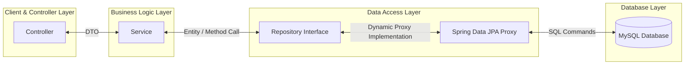
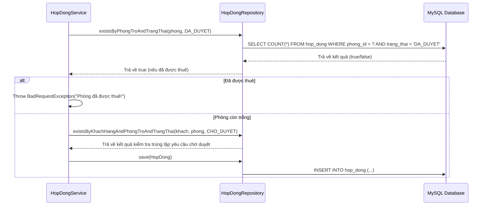

# 🗄️ Tầng Repository: Spring Data JPA & Giao Tiếp Cơ Sở Dữ Liệu

Tài liệu này cung cấp góc nhìn tổng quan, các cơ chế kỹ thuật cốt lõi, luồng đi của dữ liệu và bộ câu hỏi vấn đáp (Q&A) về tầng **Repository** (sử dụng Spring Data JPA) trong dự án **Smart Room Rental**.

---

## 🏛️ 1. Góc Nhìn Tổng Quan Về Tầng Repository

Tầng **Repository** (Data Access Layer) đóng vai trò trung gian giữa **Logic Nghiệp Vụ (Service)** và **Cơ Sở Dữ Liệu (MySQL)**. Trong Spring Boot, thay vì viết các câu lệnh JDBC dài dòng hay tự triển khai các class kết nối thủ công, chúng ta sử dụng **Spring Data JPA** để tối giản hóa toàn bộ quá trình này.



### 🎯 Vai trò chính của Repository:
1. **Trừu tượng hóa việc truy cập dữ liệu**: Giúp lập trình viên chỉ cần khai báo các phương thức (interfaces) mà không cần quan tâm đến cách viết code Driver kết nối cụ thể.
2. **Ngăn chặn SQL Injection**: Spring Data JPA sử dụng `PreparedStatement` bên dưới để tự động bind tham số một cách an toàn.
3. **Quản lý Cache & Transaction**: Tích hợp chặt chẽ với Hibernate (First-level cache / Persistence Context) để tối ưu hóa số lượng truy vấn gửi tới Database.
4. **Hỗ trợ phân trang và sắp xếp (Paging & Sorting)**: Xử lý dữ liệu lớn một cách dễ dàng và hiệu quả.

---

## 🔄 2. Các Cơ Chế & Kỹ Thuật Cốt Lõi Trong Repository

### 1️⃣ Kế thừa `JpaRepository<T, ID>`
Tất cả các repository trong dự án (ví dụ: [TaiKhoanRepository](file:///d:/test_antigravity/backend/src/java/com/btl/server/repository/TaiKhoanRepository.java)) đều kế thừa `JpaRepository`.
* **T**: Lớp Entity tương ứng (ví dụ: `TaiKhoan`).
* **ID**: Kiểu dữ liệu của Khóa chính (thường là `Long`).

> **Các phương thức CRUD được cung cấp sẵn:**
> * `save(T entity)`: Lưu mới hoặc cập nhật thực thể (nếu đã có `id`).
> * `findById(ID id)`: Tìm kiếm bản ghi theo khóa chính (trả về `Optional<T>`).
> * `existsById(ID id)`: Kiểm tra sự tồn tại của bản ghi theo khóa chính.
> * `deleteById(ID id)`: Xóa bản ghi theo khóa chính.
> * `count()`: Đếm tổng số bản ghi trong bảng.

---

### 2️⃣ Query Creation (Derived Query Methods)
Cơ chế tự sinh câu lệnh SQL dựa vào **tên phương thức** (Method Name). Spring Data JPA phân tích cú pháp (parser) tên hàm bắt đầu bằng các tiền tố như `findBy`, `existsBy`, `countBy`, `deleteBy`, kết hợp với các từ khóa điều kiện.

* **Ví dụ trong dự án**:
  * `Optional<TaiKhoan> findByUsername(String username)`
    * 👉 *SQL sinh ra*: `SELECT * FROM tai_khoan WHERE username = ?`
  * `List<PhongTro> findByTrangThai(TrangThaiPhong trangThai)`
    * 👉 *SQL sinh ra*: `SELECT * FROM phong_tro WHERE trang_thai = ?`
  * `boolean existsByPhongTroAndTrangThai(PhongTro phongTro, TrangThaiHopDong trangThai)`
    * 👉 *SQL sinh ra*: `SELECT CASE WHEN COUNT(id) > 0 THEN TRUE ELSE FALSE END FROM hop_dong WHERE phong_tro_id = ? AND trang_thai = ?`
  * `List<PhongTro> findByTenPhongContainingIgnoreCase(String tenPhong)`
    * 👉 *SQL sinh ra*: `SELECT * FROM phong_tro WHERE LOWER(ten_phong) LIKE LOWER(CONCAT('%', ?, '%'))`

---

### 3️⃣ Custom Query với `@Query` (JPQL & Native Query)
Khi nghiệp vụ phức tạp (như join nhiều bảng hoặc kiểm tra điều kiện động), việc viết tên hàm sẽ quá dài và không tối ưu. Lúc này ta dùng `@Query`.

* **JPQL (Java Persistence Query Language)**: Truy vấn trên đối tượng Java (Entity và Property) chứ không phải tên bảng/cột thực tế dưới MySQL.
  * **Ví dụ lọc động phòng trọ ([PhongTroRepository.java](file:///d:/test_antigravity/backend/src/java/com/btl/server/repository/PhongTroRepository.java#L31-L41))**:
    ```java
    @Query("SELECT p FROM PhongTro p WHERE " +
           "(:tenPhong IS NULL OR LOWER(p.tenPhong) LIKE LOWER(CONCAT('%', :tenPhong, '%'))) AND " +
           "(:diaChi IS NULL OR LOWER(p.diaChi) LIKE LOWER(CONCAT('%', :diaChi, '%'))) AND " +
           "(:giaToiThieu IS NULL OR p.giaPhong >= :giaToiThieu) AND " +
           "(:giaToiDa IS NULL OR p.giaPhong <= :giaToiDa) AND " +
           "(:trangThai IS NULL OR p.trangThai = :trangThai)")
    List<PhongTro> searchPhongTro(@Param("tenPhong") String tenPhong, ...);
    ```
    * *Đặc điểm*: Dùng mệnh đề `:param IS NULL OR ...` giúp tham số truyền vào có thể bỏ trống (optional) mà vẫn đảm bảo tính đúng đắn của câu SQL.

---

### 4️⃣ Cập Nhật Dữ Liệu Lớn Với `@Modifying` & `@Transactional`
Mặc định, các truy vấn JPA chỉ phục vụ việc đọc dữ liệu (`SELECT`). Khi ta thực hiện các câu lệnh sửa đổi như `UPDATE` hoặc `DELETE` thông qua `@Query`, ta **bắt buộc** phải khai báo thêm hai annotation này.

* **`@Modifying`**: Báo hiệu cho Spring Data JPA biết đây là một thao tác thay đổi trạng thái dữ liệu (DML - Data Manipulation Language), để nó biên dịch và thực thi câu lệnh SQL phù hợp thay vì chờ đợi trả về một tập kết quả ResultSet.
* **`clearAutomatically = true`**: Đồng bộ hóa dữ liệu. Khi chạy câu lệnh Update trực tiếp trong Database, các thực thể lưu trong bộ nhớ đệm (Persistence Context/Hibernate Cache) của phiên làm việc đó sẽ bị **lỗi thời** (stale data). Khai báo này sẽ tự động xóa bộ nhớ đệm để các truy vấn sau đó bắt buộc phải tìm kiếm trực tiếp từ Database mới.

* **Ví dụ trong dự án ([HopDongRepository.java](file:///d:/test_antigravity/backend/src/java/com/btl/server/repository/HopDongRepository.java#L23-L29))**:
  ```java
  @Modifying(clearAutomatically = true)
  @Query("UPDATE HopDong h SET h.trangThai = :trangThaiMoi WHERE h.phongTro.id = :phongTroId AND h.id <> :hopDongIdDuocDuyet AND h.trangThai = :trangThaiCu")
  int tuChoiCacHopDongChoDuyetKhac(...);
  ```

---

### 5️⃣ Projection (Chiếu Dữ Liệu Tối Ưu)
Khi chỉ cần lấy một số cột nhất định của bảng để hiển thị thay vì lấy toàn bộ các cột cồng kềnh của Entity, ta sử dụng **Projection Interface**. Việc này giúp tối ưu hóa bộ nhớ và tăng tốc độ truyền tải dữ liệu.

* **Ví dụ lấy danh sách chủ trọ ([TaiKhoanRepository.java](file:///d:/test_antigravity/backend/src/java/com/btl/server/repository/TaiKhoanRepository.java#L22-L31))**:
  ```java
  @Query("SELECT t.id AS id, t.username AS username, t.locked AS locked, k.hoTen AS hoTen " +
         "FROM TaiKhoan t LEFT JOIN t.khachHang k WHERE t.role = 'ROLE_LANDLORD'")
  List<ChuTroProjection> findChuTroProjections();

  // Interface định nghĩa các cột cần lấy thông qua hàm getter
  public interface ChuTroProjection {
      Long getId();
      String getUsername();
      Boolean getLocked();
      String getHoTen();
  }
  ```

---

## ⚙️ 3. Các Luồng Nghiệp Vụ Sử Dụng Repository Thực Tế

### 🛠️ Luồng 1: Quy Trình Đăng Ký Thuê Phòng & Kiểm Tra Trùng Lặp
Khi Khách thuê nhấn nút đăng ký một phòng trọ, hệ thống cần kiểm tra xem phòng đó có đang bị thuê hoặc đang chờ duyệt hợp đồng bởi chính người đó hay không.



---

### 🛠️ Luồng 2: Phê Duyệt Hợp Đồng & Bulk-Update Hủy Các Yêu Cầu Khác
Khi chủ nhà click phê duyệt hợp đồng ID = `10` của Phòng `101`, tất cả các hợp đồng ở trạng thái `CHO_DUYET` khác của Phòng `101` phải tự động bị chuyển sang trạng thái từ chối (`DA_HUY`) ngay lập tức để giải phóng tài nguyên.

1. **Service** gọi hàm phê duyệt: `hopDong.setTrangThai(TrangThaiHopDong.DA_DUYET); hopDongRepository.save(hopDong);`
2. **Service** thay đổi trạng thái phòng: `phongTro.setTrangThai(TrangThaiPhong.DA_THUE); phongTroRepository.save(phongTro);`
3. **Service** thực hiện từ chối hàng loạt các yêu cầu khác:
   ```java
   hopDongRepository.tuChoiCacHopDongChoDuyetKhac(phongId, hopDongId, TrangThaiHopDong.CHO_DUYET, TrangThaiHopDong.DA_HUY);
   ```
4. **Repository** dịch câu lệnh Update SQL và thực thi trực tiếp trên Database.
5. **Persistence Context** tự động được xóa (`clearAutomatically = true`) đảm bảo tính nhất quán của bộ nhớ đệm Hibernate.

---

### 🛠️ Luồng 3: Chốt Số & Tính Tiền Hóa Đơn Hàng Tháng
1. Chủ trọ điền chỉ số điện nước mới cho phòng `101` qua giao diện.
2. Tầng **Service** nhận dữ liệu, gọi `phongTroRepository.findById(phongId)` để lấy chỉ số cũ.
3. So sánh: `soDienMoi >= phongTro.getSoDienCu()`.
4. Nếu hợp lệ:
   * Lưu chỉ số mới đè vào `phongTro.setSoDienCu(soDienMoi)`.
   * Tạo bản ghi mới trong bảng `ChiSoDienNuoc` và gọi `chiSoDienNuocRepository.save(chiSo)`.
   * Tạo bản ghi `HoaDon` mới, tính toán thành tiền và gọi `hoaDonRepository.save(hoaDon)`.

---

## 💬 4. Bộ Câu Hỏi Vấn Đáp Về Tầng Repository (Q&A)

### ❓ Câu 1: Tại sao tầng Repository chỉ khai báo các `interface` mà không cần viết các class triển khai (implement) cụ thể?
* **Trả lời**: Đây là một tính năng cực kỳ mạnh mẽ của **Spring Data JPA** sử dụng kỹ thuật **JDK Dynamic Proxy**. Khi ứng dụng khởi chạy, Spring Container quét qua các interface có gắn `@Repository` hoặc kế thừa `JpaRepository`. Nó tự động tạo ra một đối tượng Proxy (class ẩn thực thi interface đó) và nạp vào Spring Container làm một Bean. Khi ta gọi phương thức, Proxy này sẽ dịch tên phương thức hoặc đọc cấu hình annotation `@Query` để tạo câu lệnh SQL tương ứng rồi gửi đến JDBC Driver thực thi.

---

### ❓ Câu 2: Sự khác biệt giữa JPQL (Java Persistence Query Language) và Native SQL Query là gì? Khi nào dùng cái nào?
* **Trả lời**:
  * **JPQL**:
    * Truy vấn trên thực thể class Java (Entity) và các thuộc tính của nó (ví dụ: `SELECT p FROM PhongTro p WHERE p.giaPhong = :gia`).
    * Có tính độc lập với hệ quản trị CSDL (Database Independence). Nếu ta đổi database từ MySQL sang PostgreSQL hoặc Oracle, Spring JPA sẽ tự sinh câu lệnh SQL phù hợp mà ta không cần sửa code.
    * Hỗ trợ kiểm tra cú pháp và kiểu dữ liệu ngay lúc compile.
  * **Native SQL Query**:
    * Truy vấn trực tiếp bằng câu lệnh SQL thuần túy của hệ quản trị CSDL (ví dụ: `SELECT * FROM tbl_phong_tro WHERE gia_phong = ?`). Ta kích hoạt bằng `@Query(value = "...", nativeQuery = true)`.
    * Phụ thuộc chặt chẽ vào loại database sử dụng. Rất khó chuyển đổi hệ quản trị CSDL sau này.
    * Không hỗ trợ type safety lúc biên dịch.
  * **Khi nào dùng**: Luôn ưu tiên dùng **JPQL** để tận dụng tối đa lợi ích của ORM và bảo trì code dễ dàng. Chỉ dùng **Native Query** khi cần sử dụng các hàm đặc thù của MySQL (ví dụ: các hàm xử lý chuỗi phức tạp, xử lý không gian spatial) hoặc tối ưu hóa các truy vấn báo cáo cực kỳ phức tạp mà JPQL không biểu diễn được.

---

### ❓ Câu 3: Em hãy giải thích cơ chế hoạt động và tầm quan trọng của `@Modifying(clearAutomatically = true)`?
* **Trả lời**: 
  * Khi ta gọi một hàm sửa đổi dữ liệu qua `@Query` (ví dụ: `UPDATE` hoặc `DELETE`), Hibernate sẽ gửi lệnh trực tiếp xuống Database. Lúc này, Database đã cập nhật giá trị mới.
  * Tuy nhiên, **Hibernate Persistence Context** (bộ nhớ đệm cấp 1) vẫn đang giữ phiên bản thực thể cũ (stale data) trước khi cập nhật.
  * Nếu tiếp tục dùng đối tượng đó trong cùng một Transaction, dữ liệu cũ sẽ được trả về thay vì dữ liệu mới trong Database, dẫn đến lỗi bất đồng bộ.
  * Thuộc tính `clearAutomatically = true` báo hiệu cho Spring Data JPA thực hiện lệnh `EntityManager.clear()` ngay sau khi chạy lệnh Update/Delete. Việc này dọn sạch bộ nhớ đệm, ép buộc các truy vấn sau đó phải gọi trực tiếp xuống Database để lấy dữ liệu mới nhất.

---

### ❓ Câu 4: Phân biệt `findById()` và `existsById()`. Tại sao `findById()` lại trả về đối tượng `Optional`?
* **Trả lời**:
  * `findById(ID id)`: Thực hiện truy vấn và trả về toàn bộ dữ liệu của bản ghi dưới dạng `Optional<T>`. Nếu tìm thấy, `Optional` chứa thực thể; nếu không, nó chứa `Optional.empty()`.
  * `existsById(ID id)`: Chỉ thực hiện truy vấn tối ưu dạng `SELECT COUNT(id) FROM ... WHERE id = ?`. Trả về kiểu `boolean` trực tiếp. Rất nhẹ và nhanh khi ta chỉ cần check xem bản ghi có tồn tại hay không mà không cần lấy dữ liệu ra xử lý.
  * **Tại sao dùng `Optional`**: Nhằm tránh lỗi kinh điển **`NullPointerException`**. Bằng cách ép lập trình viên phải kiểm tra sự tồn tại (sử dụng `.isPresent()`, `.ifPresent()`, hoặc dùng `.orElseThrow()`) trước khi trích xuất giá trị, giúp mã nguồn an toàn và tường minh hơn.
  * *Ví dụ*: `TaiKhoan taiKhoan = taiKhoanRepository.findById(id).orElseThrow(() -> new NotFoundException("Tài khoản không tồn tại"));`

---

### ❓ Câu 5: Làm thế nào để implement chức năng Tìm kiếm phân trang và Sắp xếp (Paging & Sorting) bằng Repository?
* **Trả lời**:
  * Spring Data JPA hỗ trợ sẵn phân trang bằng cách truyền tham số `Pageable` vào phương thức Repository. Phương thức sẽ trả về đối tượng dạng `Page<T>` chứa cả danh sách kết quả lẫn các thông tin bổ trợ (tổng số trang, tổng số bản ghi, trang hiện tại).
  * **Khai báo trong Repository** ([TaiKhoanRepository.java](file:///d:/test_antigravity/backend/src/java/com/btl/server/repository/TaiKhoanRepository.java#L20)):
    ```java
    Page<TaiKhoan> findAll(Pageable pageable);
    ```
  * **Sử dụng trong Service**:
    ```java
    // Tạo đối tượng Pageable (Trang số 0, mỗi trang 10 bản ghi, sắp xếp theo tên tăng dần)
    Pageable pageable = PageRequest.of(page, size, Sort.by("hoTen").ascending());
    Page<TaiKhoan> pageResult = taiKhoanRepository.findAll(pageable);
    
    List<TaiKhoan> list = pageResult.getContent(); // Danh sách bản ghi trang hiện tại
    long totalElements = pageResult.getTotalElements(); // Tổng số bản ghi trong DB
    ```

---

### ❓ Câu 6: Làm thế nào để tránh lỗi N+1 Query trong JPA khi truy vấn các thực thể có quan hệ với nhau (Ví dụ PhongTro có List<HopDong>)?
* **Trả lời**:
  * **Lỗi N+1 Query**: Xảy ra khi ta truy vấn 1 thực thể cha (ví dụ lấy danh sách 10 phòng trọ), sau đó với mỗi phòng trọ, Hibernate lại tự động chạy thêm 1 câu lệnh SQL phụ để lấy danh sách hợp đồng của phòng đó. Tổng cộng sẽ chạy `1 + 10 = 11` câu lệnh SQL, gây giảm hiệu năng nghiêm trọng khi dữ liệu lớn.
  * **Cách khắc phục**:
    1. Sử dụng **`JOIN FETCH`** trong `@Query` để lấy cả thực thể cha và các thực thể con liên quan chỉ trong 1 câu lệnh SQL duy nhất:
       ```java
       @Query("SELECT p FROM PhongTro p LEFT JOIN FETCH p.danhSachHopDong")
       List<PhongTro> findAllWithHopDong();
       ```
    2. Sử dụng `@EntityGraph` để định nghĩa các thuộc tính cần tải sớm (Eagerly Loaded).
