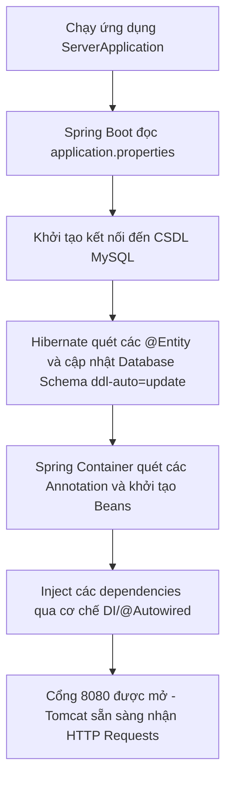

# 🏛️ Tổng Quan Kiến Trúc & Cấu Trúc Backend Spring Boot

Tài liệu này giải thích chi tiết về kiến trúc tổng thể, cấu trúc thư mục, các công nghệ/thư viện cốt lõi và luồng khởi chạy của dự án Backend **Smart Room Rental** (Spring Boot).

---

## 📂 1. Cấu Trúc Thư Mục & Vai Trò Từng Tầng

Dự án được thiết kế theo mô hình **3 lớp chuẩn (3-Tier Architecture)** kết hợp các thành phần bổ trợ để quản lý bảo mật và giao tiếp thời gian thực:

```
backend/src/java/com/btl/server/
├── ServerApplication.java        # File chạy chính, khởi động Spring Boot
├── config/                        # Cấu hình hệ thống (như WebSocket)
├── controller/                    # Tầng API endpoints (nhận request, trả response)
├── dto/                           # Data Transfer Object (đối tượng truyền nhận dữ liệu)
├── entity/                        # Các thực thể JPA tương ứng với bảng trong Database
├── enums/                         # Định nghĩa các hằng số trạng thái (Role, TrangThai...)
├── exception/                     # Xử lý lỗi toàn cục (Global Exception Handler)
├── repository/                    # Giao tiếp cơ sở dữ liệu (Spring Data JPA)
├── security/                      # Bộ lọc bảo mật, JWT, OAuth2 (Google)
└── service/                       # Tầng xử lý logic nghiệp vụ chính (Business Logic)
```

### Chi tiết vai trò từng tầng:
1.  **ServerApplication.java**:
    *   Điểm bắt đầu của ứng dụng. Chứa hàm `main` và annotation `@SpringBootApplication`.
    *   Nhiệm vụ: Khởi tạo Spring Container, tự động cấu hình (Auto-configuration) và quét component (Component Scanning) trong toàn bộ package `com.btl.server`.
2.  **Controller (Tầng điều khiển)**:
    *   Đánh dấu bằng `@RestController` và cấu hình đường dẫn bằng `@RequestMapping`.
    *   Nhiệm vụ: Lắng nghe các yêu cầu HTTP (GET, POST, PUT, DELETE), tiếp nhận dữ liệu đầu vào, gọi tầng Service xử lý và trả về phản hồi JSON chuẩn qua `ResponseEntity`.
3.  **Service (Tầng nghiệp vụ)**:
    *   Đánh dấu bằng `@Service` và `@Transactional` khi cần quản lý transaction (giao dịch cơ sở dữ liệu).
    *   Nhiệm vụ: Chứa toàn bộ logic nghiệp vụ (Ví dụ: kiểm tra phòng trống trước khi tạo hợp đồng, tính tiền điện nước dựa trên số cũ/mới, gửi mail thông báo OTP).
4.  **Repository (Tầng truy cập dữ liệu)**:
    *   Đánh dấu bằng `@Repository` và kế thừa `JpaRepository<Entity, ID>`.
    *   Nhiệm vụ: Spring Data JPA sẽ tự động sinh mã SQL tương ứng. Chứa các phương thức truy vấn sẵn có (như `save`, `findById`, `findAll`) và các phương thức tự định nghĩa bằng Query Method (như `findByUsername`) hoặc `@Query`.
5.  **Entity (Tầng mô hình dữ liệu)**:
    *   Đánh dấu bằng `@Entity` và `@Table`.
    *   Nhiệm vụ: Map trực tiếp cấu trúc Class Java thành bảng vật lý trong MySQL database.
6.  **DTO (Data Transfer Object)**:
    *   Nhiệm vụ: Đóng gói dữ liệu truyền giữa client và server. Giúp bảo mật thông tin (không phơi bày toàn bộ thực thể Entity ra ngoài), tối ưu hóa dung lượng truyền tải và thực hiện validation đầu vào (sử dụng `@NotNull`, `@Pattern`, v.v.).

---

## 🛠️ 2. Công Nghệ & Các Thư Viện Cốt Lõi Sử Dụng

| Công nghệ / Thư viện | Phiên bản (Target) | Vai trò trong dự án |
| :--- | :--- | :--- |
| **Java Development Kit (JDK)** | Java 21 | Phiên bản chạy chính, hỗ trợ các tính năng Java mới nhất. |
| **Spring Boot Web** | 3.2.x | Tạo RESTful APIs, tích hợp Tomcat Server nhúng chạy trên cổng 8080. |
| **Spring Data JPA & Hibernate**| 3.2.x | Quản lý kết nối DB, tự động ánh xạ đối tượng thành SQL, tự động sinh bảng. |
| **Spring Security** | 3.2.x | Phân quyền bảo mật hệ thống (Admin, Landlord, Tenant, Guest). |
| **Spring Mail** | 3.2.x | Giao tiếp với máy chủ SMTP của Gmail để gửi mã OTP, thông báo hóa đơn. |
| **Spring WebSocket (Stomp)** | 3.2.x | Tạo cổng kết nối hai chiều thời gian thực (realtime) phục vụ chức năng chat. |
| **Lombok** | - | Tự động sinh Getter/Setter, Constructor, Builder thông qua Annotation, giúp code sạch hơn. |
| **jjwt (Java JWT)** | 0.11.5 | Tạo (Generate) và giải mã (Parse) mã Token JWT phục vụ xác thực không lưu trạng thái (Stateless). |

---

## 🔄 3. Luồng Khởi Chạy Dự Án (Start-up Flow)

Khi ta chạy lệnh khởi động backend, quy trình diễn ra như sau:



---

## 💬 4. Bộ Câu Hỏi Vấn Đáp Bảo Vệ Đồ Án (Q&A)

### ❓ Câu 1: Tại sao dự án của em lại chia thành nhiều lớp (Controller, Service, Repository, Entity)? Có lợi ích gì?
*   **Trả lời**: Đây là kiến trúc 3 lớp (3-tier architecture) tiêu chuẩn giúp thực hiện nguyên tắc **Single Responsibility Principle (Đơn nhiệm)** trong thiết kế phần mềm. 
    *   *Controller* chỉ lo việc tiếp nhận và phản hồi dữ liệu.
    *   *Service* chỉ tập trung xử lý logic nghiệp vụ.
    *   *Repository* chỉ chuyên kết nối và truy vấn DB.
    *   *Lợi ích*: Giúp mã nguồn dễ bảo trì, dễ viết kiểm thử độc lập (unit test), dễ tái sử dụng và tránh tình trạng code bị rối (spaghetti code).

### ❓ Câu 2: Dependency Injection (DI) và Inversion of Control (IoC) là gì? Trong dự án em áp dụng nó ở đâu?
*   **Trả lời**:
    *   **IoC (Đảo ngược điều khiển)**: Thay vì lập trình viên tự khởi tạo đối tượng bằng từ khóa `new`, việc quản lý vòng đời của đối tượng (Beans) sẽ được nhượng quyền cho Spring Container quản lý.
    *   **DI (Tiêm phụ thuộc)**: Là một cách hiện thực hóa IoC. Spring Container sẽ tự động "tiêm" (inject) các đối tượng phụ thuộc vào class cần nó.
    *   *Áp dụng*: Em sử dụng annotation `@Autowired` (hoặc Constructor Injection) để tiêm `Repository` vào `Service`, tiêm `Service` vào `Controller`.

### ❓ Câu 3: `@SpringBootApplication` là gì? Nó tích hợp những Annotation nào bên trong?
*   **Trả lời**: Đây là annotation chính đặt ở file khởi chạy. Nó tích hợp 3 annotation quan trọng:
    1.  `@SpringBootConfiguration`: Đánh dấu class này là nguồn cấu hình của Spring Boot.
    2.  `@EnableAutoConfiguration`: Kích hoạt cơ chế tự động cấu hình dựa trên các thư viện khai báo trong file `pom.xml`.
    3.  `@ComponentScan`: Cho phép Spring quét toàn bộ các class có gắn annotation như `@Component`, `@RestController`, `@Service`, `@Repository` để biến chúng thành Spring Beans.

### ❓ Câu 4: Lombok giúp ích gì cho dự án của em? Kể tên các Annotation của Lombok mà em đã dùng?
*   **Trả lời**: Lombok giúp giảm bớt lượng code rác (boilerplate code) như các hàm Getter, Setter, Constructors, toString, v.v.
    *   Các annotation em dùng:
        *   `@Getter` / `@Setter`: Sinh code getter/setter.
        *   `@NoArgsConstructor` / `@AllArgsConstructor`: Sinh constructor không tham số và đầy đủ tham số.
        *   `@Data`: Tích hợp cả getter, setter, toString, equals và hashCode.
        *   `@Builder`: Hỗ trợ tạo đối tượng theo mẫu thiết kế Builder (Builder Pattern) giúp khởi tạo code đẹp và trực quan hơn.
